<p align="center">
  <picture>
    <source srcset="src/ui/assets/logo.svg" type="image/svg+xml">
    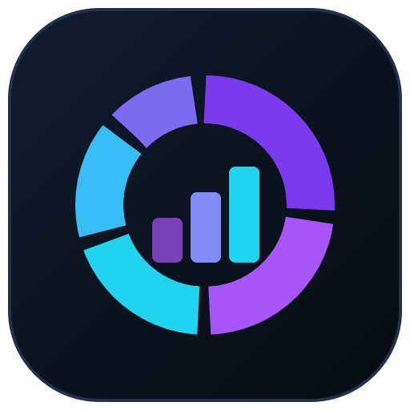
  </picture>
</p>

<h1 align="center">Portfolio Analyzer</h1>

<p align="center">
  A native desktop portfolio-analytics app — backtest, optimize, measure risk, plan retirement, and watch your holdings live, with a plain-English explanation for every result.
</p>

<p align="center">
  <a href="https://github.com/ccharafeddine/Portfolio_Analyzer/actions/workflows/ci.yml"></a>
  <a href="https://github.com/ccharafeddine/Portfolio_Analyzer/releases"></a>
  <a href="https://github.com/ccharafeddine/Portfolio_Analyzer/releases"></a>
  
  
  
  
  <a href="LICENSE"></a>
</p>

---

A native desktop portfolio-analytics application built with Python and PySide6 (Qt6). It runs an 18-step analysis pipeline covering an inception-aware backtest engine, portfolio optimization, performance measurement, risk decomposition, factor and sector attribution, income tracking, tax-aware analysis, retirement/withdrawal planning, and Monte Carlo forecasting — plus a live News & Macro tab for market context — all rendered as interactive Plotly charts in a switchable, Bloomberg-style dark UI, with client-ready HTML, PDF, and PowerPoint reports plus a full CSV data pack.

Every result is paired with a plain-English explanation, so the app is usable by advisors and analysts as well as non-finance retail investors.

<p align="center">
  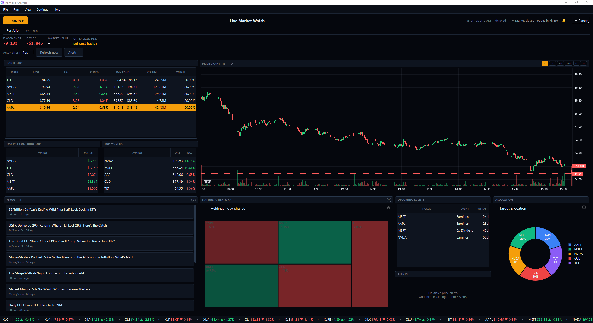
  <br>
  <em>Live Market Watch: a free-form, snap-to-grid cockpit over your live portfolio.</em>
</p>

---

## Table of Contents

- [Highlights](#highlights)
- [Features at a Glance](#features-at-a-glance)
- [Getting Started](#getting-started)
- [How It Works](#how-it-works)
- [Analysis Tabs in Detail](#analysis-tabs-in-detail)
  - [Overview](#1-overview)
  - [Performance](#2-performance)
  - [Risk](#3-risk)
  - [Attribution](#4-attribution)
  - [Income](#5-income)
  - [Optimization](#6-optimization)
  - [Forecast](#7-forecast)
  - [Fundamentals](#8-fundamentals)
  - [News](#9-news)
  - [Macro](#10-macro)
  - [Data](#11-data)
- [Roadmap (v2)](#roadmap-v2)
- [Roadmap (v3)](#roadmap-v3)
- [Roadmap (v4)](#roadmap-v4)
- [Release Notes](#release-notes)
- [Pipeline Architecture](#pipeline-architecture)
- [Project Structure](#project-structure)
- [Configuration](#configuration)
- [Testing](#testing)
- [Tech Stack](#tech-stack)
- [Limitations](#limitations)
- [License](#license)

---

## Highlights

- **Native desktop app** (PySide6 / Qt6) for Windows and macOS — no browser, no server. Charts render in an embedded QtWebEngine view, one HTML page per tab, so switching tabs is instant.
- **Inception-aware backtest engine** — correctly handles assets with different start dates (a recent IPO in a 5-year universe no longer truncates the whole history), with calendar + entry rebalancing and transaction costs.
- **Performance measurement suite** — up/down capture, batting average, tracking error, information ratio, rolling alpha/beta, and a dual-window summary (max-available vs common history).
- **Tax-aware analysis** — unrealized gains, tax-loss-harvesting candidates, and estimated tax on gains realized by rebalancing.
- **Retirement / withdrawal planning** — Monte Carlo with contributions, withdrawals, inflation, a goal target, and a solved safe-withdrawal rate.
- **Compare Portfolios** — a separate in-app section (menubar → Compare Portfolios) that runs a fast comparison of 2–6 saved portfolios (plus the current one) side by side: overlaid growth/drawdown, a return/risk metrics table, return correlation, allocation/concentration, and holdings overlap.
- **Live News & Macro** — per-holding headlines (free via yfinance, no key needed), enriched with sentiment when an Alpha Vantage key is added. A FRED key reveals a Macro tab (Treasury curve + key rates) and auto-tracks the live 3-month T-bill as the risk-free rate for the next run. Optional API keys are entered in Settings and stored locally.
- **Live Market Watch** — an always-on ticker strip across the bottom of the window plus a dedicated cockpit (Run → Live Market Watch, or the button by the metric strip). The cockpit is a **free-form, snap-to-grid dashboard** of drag-and-resize cards — quotes, a TradingView-style intraday chart, per-symbol news, a day-change heatmap/treemap, Top Movers, Day P&L Contributors, a live Allocation donut, Upcoming Events, and Active Alerts — with a market-session **clock + opening/closing bell** and **price-flash** on every change, across a Portfolio and a persistent, drag-reorderable Watchlist. Quotes are yfinance-**delayed** (15s default) by default; a Finnhub / Polygon / Alpaca key upgrades them to real-time.
- **Price alerts** — get a desktop notification when a holding crosses a price threshold (Settings → Price Alerts…).
- **Real portfolios by shares** — enter your actual holdings as share counts (and a cash balance); the app fetches prices to set Capital and derive weights. Or set cost basis inline from Live Market Watch.
- **Client-ready reports** — HTML, PDF, and a polished dark PowerPoint deck, each with proper disclosures. Plus a complete CSV data pack with a README manifest.
- **Explain-everything UX** — a circled "?" beside every chart and section title reveals what it is, how to read it, and why it matters; a Beginner mode expands these into inline plain-English blurbs.
- **Switchable themes** — Bloomberg Terminal (default), Modern Institutional, Minimal Premium, three aesthetic themes (Frutiger Aero, Corporate Synthwave, Superflat Pop), a genuine light theme (Daylight), and High Contrast (Light/Dark) — plus an adjustable UI scale.

---

## Features at a Glance

| Category | Capabilities |
|----------|-------------|
| **Portfolio Construction** | Active (custom weights **or share counts + cash**, priced live into weights & capital), Passive (benchmark), ORP (Max-Sharpe), HRP (Hierarchical Risk Parity), Rebalanced, Complete (ORP + risk-free blend) |
| **Backtest Engine** | Inception-aware series builder (rescale or cash modes for staggered start dates), calendar + asset-entry rebalancing, per-trade transaction costs, coverage timeline, full trade log |
| **Optimization** | Mean-variance efficient frontier, Capital Allocation Line, Max-Sharpe portfolio, HRP clustering + dendrogram, concentration metrics |
| **Performance Measurement** | Up/down capture, capture ratio, batting average, tracking error, information ratio, rolling alpha/beta, dual-window (max vs common) return/risk summary |
| **Risk Analytics** | VaR/CVaR (95% & 99%), max drawdown, Sortino, Calmar, skewness, kurtosis, rolling volatility & Sharpe, correlation regime detection, 8 historical stress tests |
| **Attribution & Factors** | Brinson-Fachler attribution by asset and sector, CAPM regression per asset, return-based factor tilts (beta, size, momentum, quality), GICS sector exposure |
| **Income Tracking** | Per-ticker dividends, yield on cost, current yield, income growth, cumulative income series |
| **Tax Analysis** | Unrealized gain/loss per position, harvest candidates, estimated tax on rebalancing gains (short/long/state rates, average-cost basis) |
| **Forecasting & Planning** | Parametric and bootstrap Monte Carlo (fan charts, probability of loss); retirement/withdrawal plan with contributions, withdrawals, inflation, goal funding, and safe-withdrawal-rate search |
| **Fundamentals** | Per-holding valuation, profitability, growth, balance-sheet health, dividends, and upcoming earnings/ex-dividend dates (yfinance; FMP DCF fair value when keyed) |
| **Market Context** | Per-holding news (yfinance baseline, no key; Alpha Vantage sentiment when keyed), FRED Treasury curve + key rates, on-demand Refresh and auto-refresh each run |
| **Live Market Watch** | Always-on ticker strip (View → Ticker Scroller source), a free-form snap-to-grid cockpit (quotes, candlestick chart, per-symbol news, heatmap/treemap, Top Movers, Day P&L Contributors, live Allocation, Upcoming Events, Active Alerts) across Portfolio + drag-reorderable Watchlist, market-session clock + bell, price-flash, portfolio day P&L + unrealized P&L vs. cost basis (with cash), price alerts; yfinance-delayed (15s) by default, real-time via Finnhub / Polygon / Alpaca key |
| **Reports** | Automated interpretation engine, standalone HTML report, PDF report (reportlab), client-facing PowerPoint deck (python-pptx + kaleido), each with disclosures |
| **Data Export** | ~22 CSV files + `summary.json` + a `README.txt` manifest, individually or as a ZIP |
| **UI/UX** | 11-tab native app, always-on ticker strip, 30+ Plotly chart types, 9 themes (incl. light + high-contrast), collapsible animated sections, collapsible config sidebar (app brand in it), adjustable scale, hover explanations, Beginner mode |

---

## Getting Started

### Prerequisites

- Python 3.10+ (developed on 3.13)
- Internet connection (for Yahoo Finance price data)

### Installation

```bash
git clone https://github.com/ccharafeddine/Portfolio_Analyzer.git
cd Portfolio_Analyzer
```

Create and activate a virtual environment:

```bash
# macOS / Linux
python3 -m venv .venv
source .venv/bin/activate

# Windows PowerShell
python -m venv .venv
.\.venv\Scripts\Activate.ps1
```

Install the desktop dependencies:

```bash
pip install -r requirements-desktop.txt
```

### Run the App

```bash
python main_desktop.py
```

The application window opens directly (no browser). Configure your portfolio in the left sidebar and click **Run Analysis**. Results populate across the eight tabs.

> The repository also contains the original Streamlit web app (`app.py`, `pip install -r requirements.txt`, then `streamlit run app.py`). The desktop app is the primary, actively developed product.

---

## How It Works

1. **Configure** — Enter tickers, weights, date range, benchmark, and settings in the collapsible sidebar. Advanced options (backtest inception mode, rebalancing, transaction costs), Tax, and Planning live in their own sections.
2. **Run** — Click **Run Analysis**. The pipeline fetches prices via yfinance, then executes 18 sequential steps with a full-width progress bar. The results view updates in place — no window flash.
3. **Explore** — All eight tabs are pre-rendered on completion, so switching is instant. Every chart and section carries a "?" explanation; click any section title to collapse it (animated).
4. **Export** — From the Data tab, generate an HTML, PDF, or PowerPoint report, or export the full CSV data pack (with manifest) as a ZIP.

The entire analysis runs in-process on a background worker thread so the UI stays responsive. Each pipeline step is wrapped in try/except, so a failure in one step (e.g., no dividend data) does not block the rest, and the UI hides sections where data is unavailable.

---

## Analysis Tabs in Detail

### 1. Overview

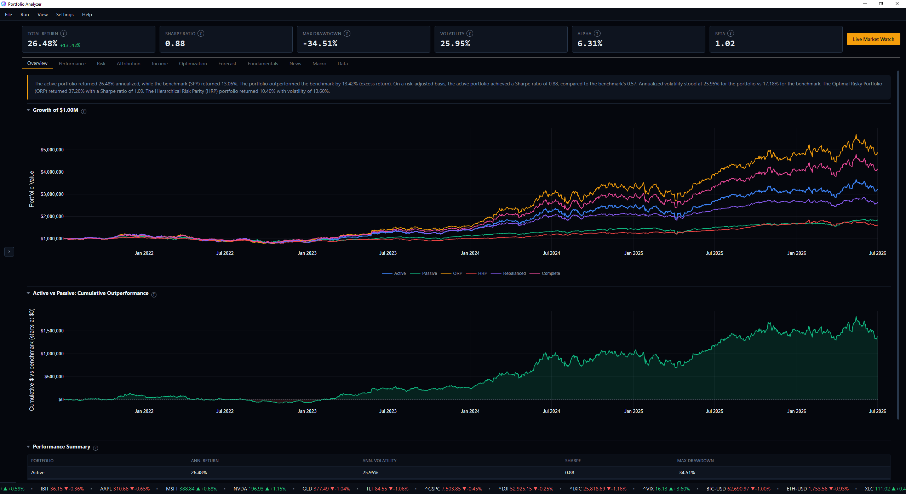

The starting point. Opens with an automated interpretation card summarizing performance using actual numbers.

- **Growth of Capital** — overlays up to six portfolio strategies (Active, Passive, ORP, HRP, Rebalanced, Complete) normalized to the same starting capital.
- **Cumulative Outperformance** — running dollar difference between the Active portfolio and the Passive benchmark, with green/red fill for out/under-performance.
- **Performance Summary** — annualized return, volatility, Sharpe, and max drawdown across all portfolio variants.

### 2. Performance

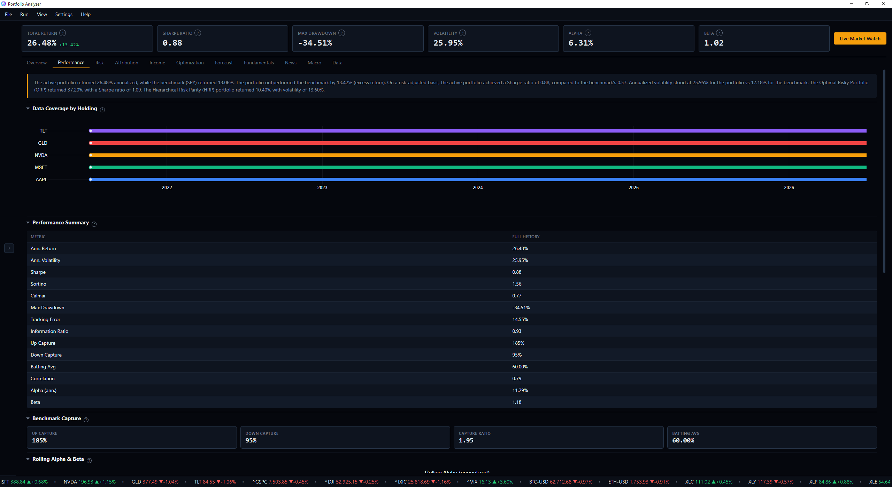

Benchmark-relative performance measurement built on the backtest engine.

- **Coverage Timeline** — a per-asset availability chart that makes staggered inception dates visible, so you can trust how a late-listed asset entered the backtest.
- **Performance Summary (dual window)** — return/risk statistics computed two ways: over each portfolio's maximum available history and over the common window in which every asset exists, making the inception caveat explicit.
- **Benchmark Capture** — up capture, down capture, capture ratio, and batting average.
- **Rolling Alpha & Beta** — how the portfolio's market sensitivity and excess return evolve over time.
- **Tax Analysis** — unrealized gain, harvestable losses, loss-candidate count, estimated tax, and a per-position detail table (shown when tax analysis is enabled).
- **Trading & Costs** — number of rebalances, average turnover, and total transaction costs charged by the engine.

### 3. Risk

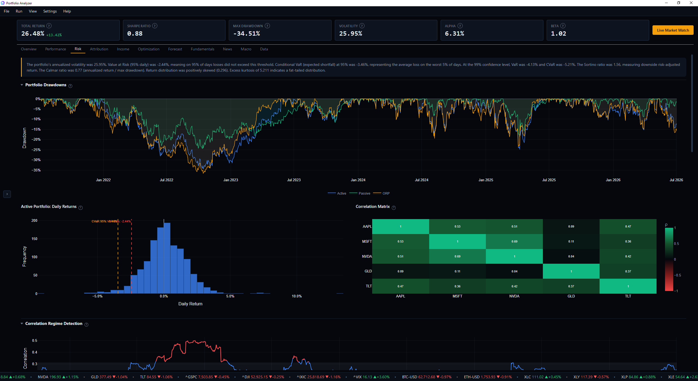

Comprehensive risk decomposition and tail analysis.

- **Drawdown Chart** — percentage decline from each portfolio's running peak.
- **Return Distribution & VaR / Correlation Heatmap** — the daily-return histogram with 95% VaR/CVaR markers, alongside the pairwise correlation matrix.
- **Correlation Regime Detection** — 63-day rolling average pairwise correlation against its long-run band; a leading indicator of stress regimes where diversification fails.
- **Rolling Volatility and Sharpe** — 12-month rolling risk and risk-adjusted return per asset.
- **Tail Risk Metrics** — Sortino, Calmar, skewness, excess kurtosis, worst/best day, gain-to-pain, and max drawdown.
- **Extended Risk Statistics** and **Stress Testing** across 8 named historical crises (COVID Crash, 2022 Bear, SVB Crisis, Aug 2024 Unwind, GFC, Taper Tantrum, China Devaluation, VIX-mageddon).

### 4. Attribution

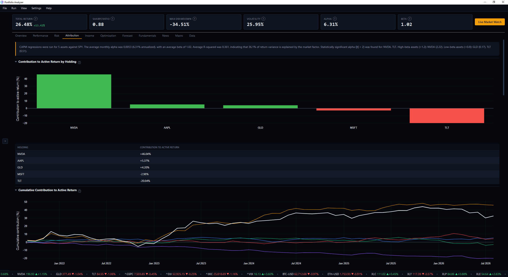

Decomposes performance into its sources.

- **Brinson-Fachler Attribution** — allocation, selection, and interaction effects, by asset and by sector.
- **Sector & Factor Exposure** — GICS sector allocation (with an Effective-N-Sectors diversification measure) and return-based factor tilts (beta, size, momentum, quality).
- **CAPM Regression** — per-asset alpha, beta, t-statistics, and R-squared, with individual excess-return scatter plots and any available multi-factor (e.g. FF3) loadings.

### 5. Income

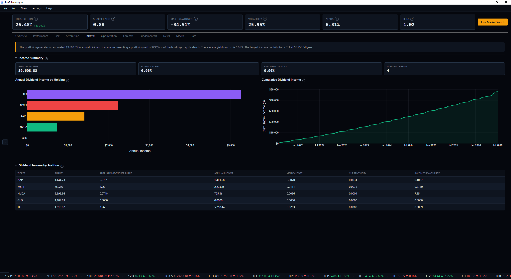

Dividend and yield analytics for income-oriented investors.

- **Income Summary** — total annual income, portfolio yield, average yield on cost, and count of dividend payers.
- **Annual Income by Position / Cumulative Income** — per-position income bars and the running total of dividends received.
- **Position-Level Table** — shares, dividend per share, annual income, yield on cost, current yield, and income growth.

### 6. Optimization

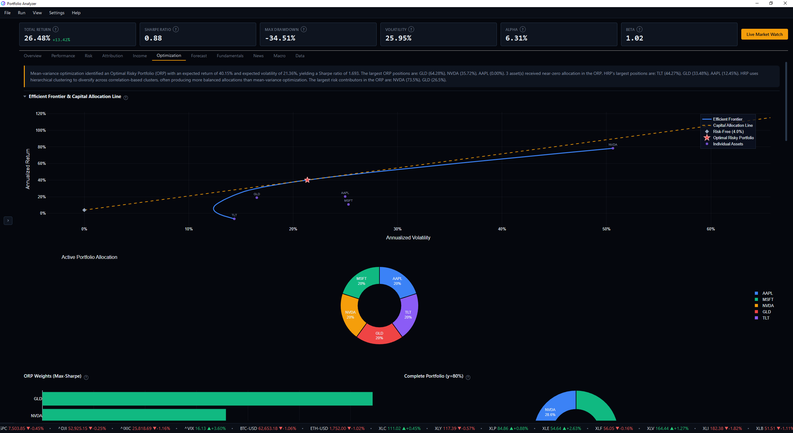

Portfolio construction and diversification analysis.

- **Efficient Frontier & Capital Allocation Line** — the mean-variance frontier, the Max-Sharpe ORP (red star), the CAL, and each asset in risk-return space.
- **ORP Weights & Complete Portfolio** — the Max-Sharpe weights and the ORP-plus-risk-free blend.
- **HRP Weights & Dendrogram** — Hierarchical Risk Parity allocation and its correlation-cluster tree.
- **Concentration Metrics** — HHI, Effective N Bets, and Top-3 concentration for Active vs ORP.
- **Weight Drift**, **Rebalanced vs Buy-and-Hold**, and **Quarterly Turnover** — how allocations drift, whether rebalancing helped, and the trading it required.

### 7. Forecast

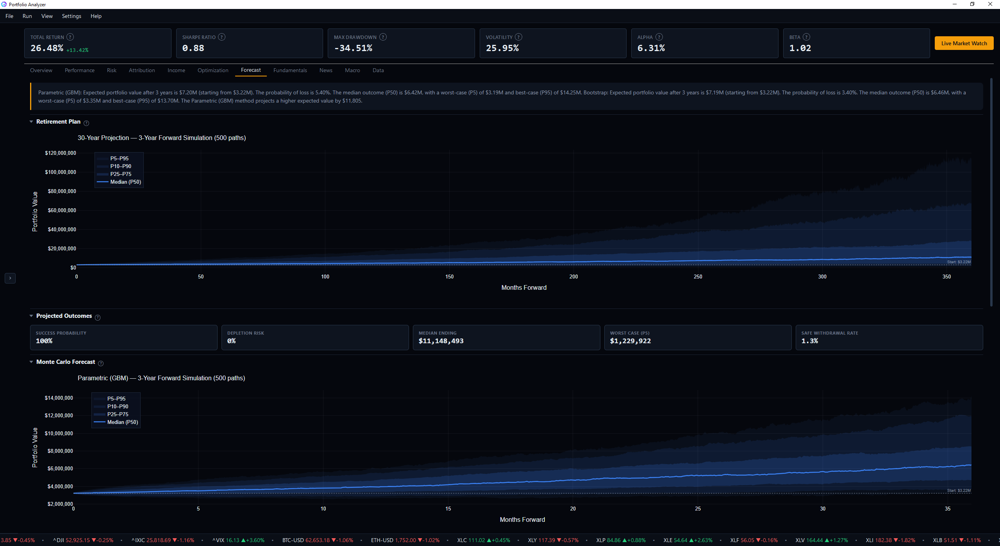

Forward-looking simulation and retirement planning.

- **Retirement Plan** — a Monte Carlo projection over a configurable horizon with contributions, withdrawals, and inflation. Reports success probability, depletion risk, median and worst-case (P5) endings, a solved safe-withdrawal rate, and goal-funding probability. Expected-return assumptions are recentered so a short historical bull run doesn't inflate long-horizon projections.
- **Monte Carlo Forecast** — parametric and bootstrap fan charts (percentile bands) with a comparison table and probability analysis.

### 8. Fundamentals

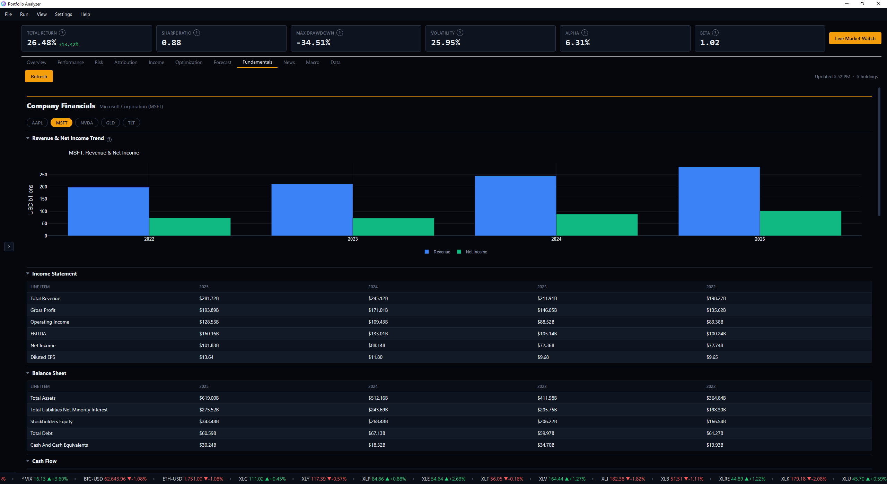

Company-level fundamentals for every holding, side by side — pulled from yfinance (no key), enriched with FMP's DCF fair value when an FMP key is set. Background-fetched (each run + Refresh); excluded from reports. Grouped comparison tables:

- **Valuation** — P/E, forward P/E, P/B, P/S, PEG, EV/EBITDA (plus DCF fair value and upside when FMP is configured).
- **Profitability** — gross/operating/net margin, ROE, ROA.
- **Growth & Financial Health** — revenue and earnings growth, debt/equity, current ratio.
- **Dividends & Profile** — dividend yield, payout ratio, beta, market cap, sector.
- **Upcoming Earnings & Ex-Dividend Dates** — the next reporting and ex-dividend dates per holding.

Below the comparison, a per-holding drill-down (pick a ticker in the toolbar) shows the **income statement, balance sheet, and cash-flow history** (annual) plus **analyst price targets and the buy/hold/sell mix** — fetched lazily and cached. Comparison tables use uniform column widths so the numbers line up down the page.

### 9. News

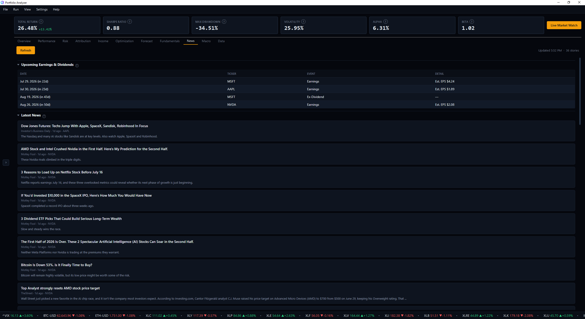

Opens with an **Upcoming Earnings & Dividends** calendar — the next earnings reports and ex-dividend dates across all holdings, soonest first (with a relative countdown and estimated EPS when available). Below it, recent headlines for every ticker in the analysis, newest first, as clickable cards that open in your browser. Fetched on a background thread — automatically on every run and on demand via a **Refresh** button — so it never blocks the UI. Works with no setup via yfinance; adding an **Alpha Vantage** key in Settings pulls more articles and a per-article **sentiment** tag (bullish/neutral/bearish). Excluded from exported reports.

### 10. Macro

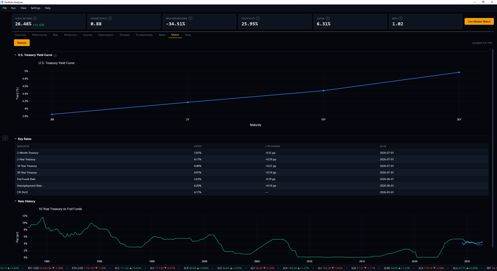

Appears only once a valid **FRED** key returns data (added in Settings → Preferences). Shows the current U.S. Treasury yield curve, a headline-rates table (Fed Funds, CPI YoY, unemployment, key tenors) with one-year changes, and a 10-Year vs Fed Funds history. Also background-fetched with a Refresh button; excluded from reports.

When macro data loads, the latest short-term Treasury yield (3-month bill) is fed back into the **Risk-free rate** config field, so the next run defaults to the live market rate. The field is labeled "Risk-free rate (live 3M T-bill)" while it's FRED-driven, and reverts to a plain label the moment you edit it manually.

### 11. Data

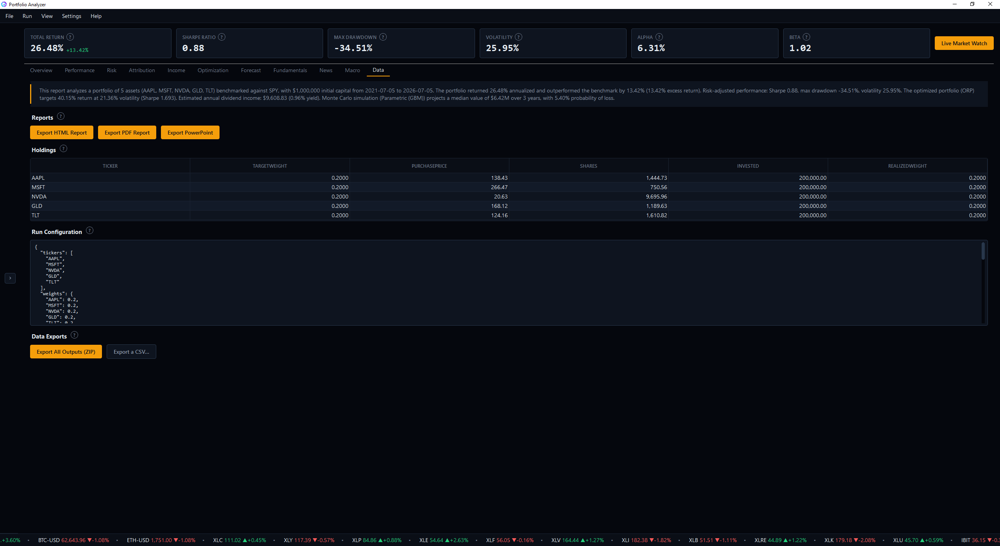

Raw data access, report generation, and export. Opens with an executive-summary interpretation card.

- **Reports** — three on-demand outputs:
  - **HTML Report** — standalone, print-ready file with a dark cover, table of contents, embedded charts (via kaleido), data tables, plain-English commentary, and disclosures.
  - **PDF Report** — reportlab document with cover, TOC, styled tables, interpretation text, embedded charts, and disclosures.
  - **PowerPoint** — a client-facing dark 16:9 deck (title, executive summary, growth, performance, risk, optimization, attribution, income, forecast, retirement, tax, disclosures), generated on a background thread.
- **Holdings** — each position's ticker, target/realized weight, shares, purchase price, and amount invested.
- **Run Configuration** — the exact settings used, as JSON, for reproducibility.
- **Data Exports** — the full CSV data pack (below), individually or as a ZIP, accompanied by a `README.txt` manifest describing every file.

---

## Pipeline Architecture

The analysis pipeline runs 18 steps sequentially. Each step reads all prior results and stores its outputs in the shared `AnalysisResults` dataclass.

```
Step  0: Fetch price data          -- Daily prices via yfinance with local parquet caching
Step  1: Build active portfolio    -- Inception-aware backtest engine: shares, daily values,
                                       rebalancing, transaction costs, coverage, trade log
Step  2: Compute rebalance         -- Weight drift from targets, turnover table
Step  3: Compute income            -- Dividend history per ticker, income + cumulative series
Step  4: Build passive portfolio   -- Benchmark units with the same capital
Step  5: Optimize (ORP & HRP)      -- Max-Sharpe, efficient frontier, HRP weights + dendrogram
Step  6: Run CAPM regressions      -- Per-asset CAPM against the benchmark
Step  7: Measure performance       -- Capture, batting, tracking error, IR, rolling alpha/beta,
                                       dual-window (max vs common) summary
Step  8: Analyze taxes             -- Unrealized gains, harvest candidates, tax on rebalancing
Step  9: Compute risk metrics      -- VaR/CVaR, drawdowns, tail metrics, correlation regime
Step 10: Run stress tests          -- Returns during 8 historical crisis periods
Step 11: Build complete portfolio  -- Blends ORP with the risk-free asset
Step 12: Run attribution           -- Brinson-Fachler by asset and sector
Step 13: Compute exposures         -- GICS sector weights, return-based factor tilts
Step 14: Monte Carlo simulation    -- Parametric + bootstrap forward simulations
Step 15: Retirement planning       -- Cashflow-aware Monte Carlo, safe-withdrawal-rate search
Step 16: Generate reports          -- Interpretation engine across all sections
Step 17: Save outputs              -- CSV data pack, summary JSON, and README manifest
```

The pipeline runs on a background `QThread` worker with a live progress bar; report generation (HTML/PDF/PowerPoint) happens on demand from the Data tab.

---

## Project Structure

```
Portfolio_Analyzer/
├── main_desktop.py                 # Desktop entry point (PySide6)
├── app.py                          # Legacy Streamlit web app
├── src/
│   ├── pipeline.py                 # 18-step orchestration + AnalysisResults dataclass
│   ├── config/
│   │   └── models.py               # Pydantic config (PortfolioConfig, BacktestConfig,
│   │                                 TaxConfig, PlanConfig, BLConfig, CompletePortfolioConfig)
│   ├── data/
│   │   ├── fetcher.py              # yfinance fetching with parquet caching
│   │   ├── market_data.py          # News (yfinance + Alpha Vantage) & FRED macro
│   │   └── transforms.py           # Returns, VaR/CVaR, drawdowns, Sharpe, etc.
│   ├── analytics/
│   │   ├── backtest.py            # Inception-aware, cost-aware backtest engine
│   │   ├── optimization.py         # Max-Sharpe, efficient frontier, min-variance
│   │   ├── hrp.py                  # Hierarchical Risk Parity
│   │   ├── regression.py           # CAPM, multi-factor, rolling alpha/beta
│   │   ├── performance.py          # Capture, batting, tracking error, IR, dual-window summary
│   │   ├── risk.py                 # Stress tests, rolling metrics, concentration, tail metrics
│   │   ├── attribution.py          # Brinson-Fachler attribution
│   │   ├── exposure.py             # Sector weights (yfinance), factor tilts (return-based)
│   │   ├── income.py               # Dividends, income summary, cumulative income
│   │   ├── tax.py                  # Unrealized gains, harvesting, tax on rebalancing
│   │   ├── simulation.py           # Monte Carlo + cashflow-aware retirement planning
│   │   └── rebalance.py            # Weight drift, turnover
│   ├── reports/
│   │   ├── interpreter.py          # Plain-English interpretation engine
│   │   ├── html_builder.py         # Standalone HTML report (Jinja2)
│   │   ├── pdf_builder.py          # PDF report (reportlab)
│   │   └── pptx_builder.py         # Client-facing PowerPoint deck (python-pptx)
│   ├── charts/
│   │   └── plotly_charts.py        # 29 chart functions (theme-aware)
│   └── ui/
│       ├── main_window.py          # Window, header, sidebar, progress, theme wiring
│       ├── config_panel.py         # Sidebar config (Advanced / Tax / Planning sections)
│       ├── settings_dialog.py      # Preferences: optional API keys (FRED, Alpha Vantage)
│       ├── sidebar.py              # Collapsible sidebar with animated toggle
│       ├── results_view.py         # The 8 tabs; eager pre-render on completion
│       ├── theme.py                # 3 themes + UI scale
│       ├── explanations.py         # "?" explanation content + Beginner mode
│       ├── worker.py               # Background analysis thread
│       ├── paths.py                # Cross-platform cache / output / export dirs
│       ├── assets/                 # Logo (mark + tiled), chevron icons
│       ├── tabs/                   # web_tab base + tab modules (incl. news_tab, macro_tab)
│       └── widgets/                # info_label, metric_card, collapsible, table model
├── tests/                          # 82 tests (portfolio, backtest, performance, tax, planning, paths)
├── requirements-desktop.txt        # Desktop app dependencies
├── requirements.txt                # Legacy Streamlit dependencies
└── README.md
```

---

## Configuration

Configuration happens in the sidebar; the UI builds a validated `PortfolioConfig` on each run. Common inputs are always visible, with **Advanced**, **Tax**, and **Planning** in collapsible sections (each field has a "?" help badge).

| Parameter | Default | Description |
|-----------|---------|-------------|
| Tickers | AAPL, MSFT, NVDA, GLD, TLT | Any valid Yahoo Finance symbols |
| Allocation | Equal (1/N) | Uncheck **Equal weights** to enter **by Weights** (target fractions) or **by Shares** (share counts). "Calculate weights" prices your shares to set Capital and derive weights |
| Cash | $0 | Cash held alongside the stocks (shares mode), modeled as a **risk-free sleeve**: it dilutes the active portfolio's return / volatility / drawdown (the honest cash drag) and shows up as a slice in the Active Portfolio Allocation donut |
| Benchmark | SPY | Single ticker for passive comparison |
| Start / End Date | trailing 5 years (today − 5y → today) | Historical window; a "Today" button snaps End to the current date |
| Capital | $1,000,000 | **Total account value** (invested + cash). In shares mode it's derived (read-only) from shares × price + cash; the analysis invests `capital − cash` in stocks and holds the cash |
| Risk-Free Rate | 4.0% | For Sharpe, CAPM, Complete portfolio. Auto-tracks the live 3-month T-bill yield after a run when a FRED key is set |
| Inception Mode | Rescale | How staggered start dates are handled (rescale weights vs hold cash) |
| Rebalance Frequency | None | Calendar rebalancing cadence |
| Transaction Cost (bps) | 0 | Cost charged on each dollar traded |
| Allow Shorts / Max Weight | Off / 1.0 | Optimization bounds |
| Complete Portfolio % in ORP | 80% | ORP vs risk-free blend |
| Tax | On | Enable tax analysis; short/long/state rates |
| Planning | On | Enable retirement plan; horizon, contribution, withdrawal, goal, inflation, expected return |

Tax and Planning are enabled by default; unchecking either removes its analysis (and its report sections) entirely.

### Optional API keys (Settings → API Keys…)

All optional and stored locally (via `QSettings`, or a `.env`/env var). The app is fully functional without them. Keys are gitignored and never leave the machine except in HTTPS requests to their own provider.

| Key | Unlocks |
|-----|---------|
| FRED | Reveals the **Macro** tab: Treasury yield curve + macro rates (free from the St. Louis Fed) |
| Alpha Vantage | Additional news articles + per-article sentiment on the **News** tab (yfinance headlines work without it) |
| FMP | DCF fair-value estimate on the **Fundamentals** tab (yfinance fundamentals work without it) |
| Finnhub / Polygon / Alpaca | Real-time quotes in Live Market Watch + the ticker strip (yfinance-delayed without a key; priority Finnhub → Polygon → Alpaca) |

### Scheduled reports & the daily morning report (Settings → Scheduled Reports…)

Two independent features live here:

- **Daily Morning Report** — a light **Morning Brief** (weighted day change, day P&L, per-holding moves, today's earnings / ex-dividend dates, and latest news) for your chosen portfolio, delivered every morning at a time you pick (default **07:00 local**). It fires while the app is running and **catches up on the next launch** if a day was missed. Delivery is a **desktop notification** (click it to open the brief) and, optionally, **email** with the full analytical report attached.
- **Batch reports** — generate the full analytical report (PDF / HTML) for *all* saved portfolios on an interval while the app runs, or via a one-line command you paste into Windows Task Scheduler / cron to run even when the app is closed.

**Email setup:** tick **Email it (SMTP)**, pick your **Provider** — Gmail, Outlook / Office 365, iCloud, or Yahoo (or **Custom**) — to auto-fill the server, port, and TLS mode, then enter your email address and recipient(s) and hit **Send test email**.

> Most providers require an **app password**, not your normal login password (e.g. Google Account → Security → 2-Step Verification → App passwords). The password is stored in your **OS keychain** (Windows Credential Locker / macOS Keychain) — never in the app's settings, a `.env`, or on disk.

---

## Testing

The suite covers every analytics, data, and desktop-support module — 237 tests:

```bash
python -m pytest -q
```

**Analytics & backtest**

| Test file | Tests | Coverage |
|-----------|-------|----------|
| `test_portfolio.py` | 55 | Config, transforms, optimization, CAPM, risk, simulation, attribution, concentration, correlation regime, HRP, rebalance, exposure, income |
| `test_backtest.py` | 7 | Inception handling (rescale vs cash), weight sums, transaction costs, coverage/effective-start |
| `test_performance.py` | 6 | Capture, batting average, tracking error, information ratio |
| `test_rebalance_trades.py` | 6 | Target/ORP rebalancing trade recommendations |
| `test_planning.py` | 5 | Cashflow simulation, safe-withdrawal-rate search, plan outcomes |
| `test_comparison.py` | 5 | Multi-portfolio comparison metrics |
| `test_ts_attribution.py` | 4 | Time-series contribution to active return |
| `test_scenario.py` | 4 | Scenario / factor-shock estimates |
| `test_factor_models.py` | 4 | FF3 / Carhart / FF5 factor regressions |
| `test_black_litterman.py` | 4 | Black-Litterman view blending |
| `test_blended_benchmark.py` | 3 | Fixed-weight blended benchmark |
| `test_tax.py` | 3 | Unrealized gains, harvest candidates, realized tax from rebalancing |
| `test_allocation.py` | 12 | Shares→weights/capital, active allocation with cash |

**Data, reports & delivery**

| Test file | Tests | Coverage |
|-----------|-------|----------|
| `test_quotes.py` | 17 | Delayed quotes, intraday/OHLC fetch, chart builders (treemap, day-change heatmap), formatting |
| `test_market_data.py` | 10 | News normalization/dedupe, Alpha Vantage sentiment, FRED macro parsing, fail-closed HTTP (no key leak), graceful failure |
| `test_watchlist.py` | 9 | Watchlist store (add/dedupe/remove/reorder/seed), symbol normalization, curated starters |
| `test_security_fixes.py` | 8 | Symbol charset validation, inline-`<script>` escaping, report autoescape |
| `test_market_session.py` | 7 | NYSE session state, holiday calendar (incl. Good Friday), DST, next open/close |
| `test_fundamentals.py` | 7 | Fundamentals fetch, DCF, statements, graceful failure |
| `test_morning_report.py` | 9 | Morning-brief math + escaping, SMTP emailer (TLS-verified, CRLF-safe, mocked), keychain roundtrip |
| `test_providers.py` | 6 | Real-time provider resolution (Finnhub/Polygon/Alpaca) + fallback |
| `test_report_generation.py` | 4 | HTML/PDF report build |
| `test_samples.py` | 3 | First-run sample-portfolio seeding (marked "(Sample)") |

**Desktop & UI (Qt-guarded)**

| Test file | Tests | Coverage |
|-----------|-------|----------|
| `test_alerts.py` | 8 | Price-alert edge-triggering, enable/re-arm, QSettings store |
| `test_theme.py` | 5 | Theme tokens, chart-palette light/dark flip, scaling |
| `test_updater.py` | 5 | Version comparison, release-check parsing |
| `test_desktop_paths.py` | 6 | Cross-platform cache/output/export directory resolution |
| `test_grid_layout.py` | 6 | Snap-grid engine: overlap/clamp/collision-resolve/auto-flow placement |
| `test_live_watch_layout.py` | 9 | Grid-cockpit panel visibility + cell persistence, drag/edge-resize, watchlist drag-reorder, price-flash, cash-aware Day P&L (skips without a display) |

Tests that would call yfinance / SMTP use `unittest.mock.patch` to avoid network dependencies, and Qt-dependent tests skip cleanly where no display or OS keychain is available (so the headless CI run stays green).

### Continuous Integration

`.github/workflows/ci.yml` runs on every push and pull request to `main`, on **Ubuntu and Windows** (Python 3.13): a critical-error lint (ruff), a compile check, and the full test suite (headless via `QT_QPA_PLATFORM=offscreen`).

---

## Building & Releases

The app is packaged with **PyInstaller** into a one-directory build (a Windows `PortfolioAnalyzer.exe` folder and a macOS `.app`), using `packaging/PortfolioAnalyzer.spec`.

**Build locally** (from the repo root, with `requirements-desktop.txt` installed):

```bash
pyinstaller packaging/PortfolioAnalyzer.spec --noconfirm
# output in dist/PortfolioAnalyzer/  (Windows)  or  dist/Portfolio Analyzer.app  (macOS)
```

**Cut a release:** push a version tag and `.github/workflows/release.yml` builds both platforms and attaches a **Windows installer (`PortfolioAnalyzer-Setup.exe`, via Inno Setup)** and a **macOS disk image (`PortfolioAnalyzer.dmg`)** to a **draft GitHub Release** (review and publish it manually):

```bash
git tag v1.0.1
git push origin v1.0.1
```

The spec bundles the app assets, `plotly` (for the offline chart JS), `kaleido` (report chart export), and QtWebEngine. The Windows installer and executable icon come from `src/ui/assets/app.ico` (`packaging/installer.iss`); a macOS `app.icns` can be dropped alongside it to set the `.app` icon. Builds are currently unsigned — Windows SmartScreen and macOS Gatekeeper will warn on first launch.

---

## Tech Stack

| Layer | Technology |
|-------|-----------|
| Desktop UI | PySide6 / Qt6 (QtWidgets + QtWebEngine) |
| Charts | Plotly (theme-aware, interactive) |
| Chart Export | kaleido (Plotly to PNG for reports) |
| Data | yfinance + local parquet cache |
| Config Validation | Pydantic v2 |
| Optimization | SciPy (minimize, SLSQP) |
| Clustering | SciPy (hierarchical linkage) |
| Statistics | NumPy, pandas, statsmodels (OLS) |
| HTML Reports | Jinja2 |
| PDF Reports | reportlab |
| PowerPoint | python-pptx |
| Cross-platform paths | platformdirs |
| Packaging | PyInstaller |
| Testing | pytest |

---

## Limitations

- **Historical returns are not predictive.** Mean-variance optimization and simulations use backward-looking estimates; future returns and correlations will differ.
- **Transaction costs are modeled simply** as a basis-point charge on dollars traded; real-world slippage, spreads, and market impact are not simulated.
- **Tax figures use a simplified average-cost model** (short/long/state rates on rebalancing gains) and are not tax advice; lot-level accounting and wash-sale rules are not modeled.
- **Dividend and sector data depend on yfinance accuracy.** Some tickers (ETFs, indices, crypto) may have incomplete dividend histories or missing sector metadata.
- **Style factor tilts are return-based proxies**; the Attribution tab also shows true Fama-French factor loadings (FF3 / Carhart 4 / FF5) regressed against the Ken French daily factors when reachable.
- **Monte Carlo assumes i.i.d. (parametric) or stationary (bootstrap) returns**, neither of which captures regime changes or structural breaks. Retirement projections recenter the mean to an expected-return assumption to reduce look-ahead bias, but remain illustrative.
- **Reports require kaleido for embedded chart images.** It is included in `requirements-desktop.txt`; without it, reports still generate with all text and tables (the PowerPoint's charts, however, depend on it).

---

## Roadmap (v2)

All v2 themes shipped as of **v2.0.0**. Grouped by theme:

**Fundamentals & data**
- [x] Company fundamentals tab — valuation, profitability, growth, balance-sheet health, dividends, upcoming earnings/ex-dividend dates.
- [x] Deeper statements (income / balance sheet / cash flow history) and analyst estimates.
- [x] Earnings & dividend calendar surfaced on the News tab.

**Portfolio depth**
- [x] Multi-portfolio compare — open several saved portfolios side by side (the **Compare Portfolios** section).
- [x] Custom / blended benchmarks (e.g., 60/40) — a "Benchmark blend" field builds a fixed-weight benchmark used across the whole analysis.
- [x] Manual Black-Litterman views UI — absolute/relative views (with confidence) blended into the optimizer's expected returns.
- [x] Real factor-model loadings (Fama-French FF3 / Carhart 4 / FF5) from the Ken French daily factors, regressed per asset + portfolio.

**Analytics**
- [x] Rebalancing / trade recommendations — concrete buy/sell orders (to your target and to the ORP) in the Optimization tab.
- [x] Scenario builder — interactive what-if shocks (macro factors + holdings) with live impact, in the Risk tab.
- [x] Time-series, benchmark-relative attribution — per-holding contribution to active return, point-in-time and cumulative over time.

**Platform & polish**
- [x] Auto-update — Settings → Check for Updates… queries GitHub Releases and prompts to download; installed builds auto-check on launch.
- [x] Scheduled / automated report generation — Settings → Scheduled Reports… (in-app interval + Generate Now), plus a headless CLI (`--generate-report --all`) for OS-level scheduling.
- [x] First-run sample portfolios (seeded on first launch; File → Open Sample).

---

## Roadmap (v3)

### Shipped

**Theming**
- [x] Additional themes — Frutiger Aero, Corporate Synthwave, and Superflat Pop, plus a Daylight light theme and High Contrast (Light/Dark). Charts flip the Plotly template by background luminance, so light themes render light end to end (not just the Qt chrome).

**Live & Market Data** — a live layer over the analyzed portfolio. Data is **delayed** by default (polled from yfinance, typically 15–20 min behind the exchange, labelled "as of … · delayed"); a real-time provider key upgrades it in place. A shared `QuotesWorker` on a `QTimer` feeds the ticker strip and the Live Market Watch view so they never disagree.
- [x] **Always-on ticker strip** — a full-width marquee of the holdings (symbol, last, day change %, theme-colored) in the bottom status bar; yields to the run progress bar and returns after. Slow scroll, pause on hover, click a symbol to open Live Market Watch.
- [x] **Live Market Watch** — a third Run-menu mode (and a button on the metric row, next to Beta):
  - [x] Sortable quotes table (ticker, last, change $/%, day range, volume, weight).
  - [x] Live portfolio header — weighted day change, day P&L, and market value + unrealized P&L vs. cost basis.
  - [x] Set cost basis inline — the "set cost basis" link or a row's right-click menu; updates live P&L, offers to save the portfolio, and re-runs the analysis.
  - [x] Refresh controls (15 / 30 / 60s / off + manual) and an "as of … · delayed/real-time" stamp.
- [x] **Persistent Watchlist** — a second tab: a user-curated symbol list (add / remove / sort, crypto shorthand like `BTC` → `BTC-USD`), saved across sessions and fully decoupled from the analyzed portfolio.
- [x] **Free-form grid cockpit** — the right-hand dashboard is a snap-to-grid of independent cards you drag by the header and resize from any edge or corner; overlaps reflow automatically and the arrangement + visibility persist per tab. Cards are added/removed from a **＋ Panels** library, and a curated default layout ships with the app.
- [x] **Cockpit panels** — price chart, per-symbol news, day-change heatmap (weight-sized **treemap** on Portfolio, equal-tile **grid** on Watchlist), **Top Movers**, **Day P&L Contributors**, a live **Allocation** donut (value-weighted with drift when cost basis is known, else target, with a Cash slice), **Upcoming Events** (earnings / ex-dividend, fetched off-thread), and **Active Alerts** (distance-to-fire).
- [x] **TradingView-style price chart** — candlesticks + volume + crosshair with switchable timeframes (1D / 5D / 1M / 6M / 1Y / 5Y), powered by the vendored, offline TradingView **Lightweight Charts** library and driven by the selected symbol.
- [x] **Per-symbol news panel** — recent headlines (publisher, time, sentiment) for whichever symbol the chart is showing; click to open the article.
- [x] **Market clock + opening/closing bell** — a top-right session status (pre-market / open / after-hours / closed) with a live countdown to the next change, honoring the NYSE holiday calendar; a synthesized bell rings at the open and close (mutable).
- [x] **Price-flash + faster default refresh** — a row pulses green/red when its last price changes on a refresh; the default delayed cadence is now 15s.
- [x] **Persistent watchlist, curated & reorderable** — ships with a default set (indices, SPDR sector ETFs, crypto, spot-BTC ETF); rows reorder by drag-and-drop, and market-context indices seed at the front.
- [x] **Ticker Scroller source in the View menu** — point the bottom strip at the Portfolio, the Watchlist, or Both (View → Ticker Scroller).
- [x] **Price alerts** — above/below a threshold, edge-triggered (fires once per crossing), delivered as a desktop notification. Manage via Settings → Price Alerts… or the Alerts… button; alerts fire even for tickers outside the loaded portfolio.
- [x] **Real-time provider slots** — Finnhub / Polygon / Alpaca keys in the **API Keys** dialog (priority finnhub > polygon > alpaca). A configured key upgrades quotes to real-time, falling back to yfinance-delayed per symbol.

**Reports & delivery**
- [x] **Daily Morning Report** — a light Morning Brief (day change, day P&L, today's earnings / ex-dividend, news) delivered every morning by desktop notification and optional email (SMTP, with one-click Gmail / Outlook / iCloud / Yahoo presets), the full report attached. Fires at a chosen clock time with launch catch-up; the email password is kept in the OS keychain. See **Configuration → Scheduled reports & the daily morning report** above for email setup.

**Hardening**
- [x] Full logic + security audit (twice) — HTML/PDF/brief output autoescaped (+ CSP), `</script>`-breakout escaping in web views, ticker/symbol charset validation, request-path URL-encoding, link-scheme allowlist, corrected cash-aware Day P&L, and clean worker-thread shutdown on exit. The v3 pass additionally hardened SMTP delivery (verified TLS certificate/hostname, CRLF-sanitized headers), fail-closed quote HTTP (no API-key leakage into error text), a bounded grid-layout restore, a fixed stale-universe events fetch, and a DST-correct morning-report timer.

**UX**
- [x] App brand (logo + name) moved into the config sidebar — folds away when the sidebar collapses — so the analysis workspace stays clean.
- [x] Enter holdings by **share count** (+ cash) and price them into weights & capital; default date range is the trailing 5 years; set cost basis inline from Live Market Watch.
- [x] **Cash as a first-class holding** — a cash balance is modeled as a risk-free sleeve held alongside the stocks: the analysis invests `capital − cash`, folds the cash back in (so the active portfolio's return / volatility / drawdown reflect the honest cash drag), shows a Cash slice in the Active Portfolio Allocation donut, and Capital now represents the full account value.

### Planned

**Bring Live Market Watch further to life** — the market clock + bell and price-flash shipped above; still on the list: per-row intraday sparklines (best suited to the wider Portfolio table) and richer alert conditions (% moves, crossing back, one-shot vs. repeating).

---

## Roadmap (v4)

**Distribution**
- [ ] Code-signing + notarization — remove the SmartScreen / Gatekeeper warnings on the installers (requires an Apple Developer ID and a Windows code-signing certificate).

---

## Release Notes

Every release ships a Windows installer (`.exe`) and a macOS disk image (`.dmg`), built and published automatically from a version tag. Oldest first.

### v1.0.0 — First desktop release
The initial PySide6 desktop app: inception-aware backtest engine; performance, risk, attribution, income, optimization, and forecast analytics; tax and retirement/withdrawal planning; live News & Macro tabs; and client-ready HTML, PDF, and PowerPoint reports.

### v1.0.1
- Fixed File-menu portfolio management (New / Open / Save) and CSV import.
- First release to ship a Windows installer (`.exe`) and a macOS disk image (`.dmg`).

### v1.1.0 — Fundamentals tab
Added a Fundamentals tab: per-holding valuation, profitability, growth, balance-sheet health, dividends, and upcoming earnings / ex-dividend dates (yfinance baseline; FMP discounted-cash-flow fair value when an API key is added).

### v1.1.1
Added an Upcoming Earnings & Dividends calendar to the News tab — the next earnings and ex-dividend dates across all holdings, soonest first.

### v1.2.0 — Financial statements
Extended the Fundamentals tab with per-company financial statements (income / balance-sheet / cash-flow history) and analyst estimates, revenue and net-income trend + comparison charts, and full-width, column-aligned statement matrices.

### v1.3.0 — Multi-Portfolio Comparison
Introduced a distinct in-app **Compare Portfolios** section that compares 2–6 portfolios side by side: overlaid growth and drawdown, a return/risk metrics table, return correlation, allocation/concentration, and holdings overlap.

### v1.4.0 — Portfolio Depth
Completed the Portfolio-depth theme:
- Multi-portfolio comparison (from v1.3.0).
- Blended (multi-asset) benchmarks, e.g. 60/40.
- Black-Litterman views — absolute/relative opinions blended into the optimizer's expected returns.
- Real Fama-French factor loadings (FF3 / Carhart 4 / FF5) from the Ken French daily factors.

### v1.4.1
Fixed the Attribution tab's Fama-French section: the header now collapses all three models together, and each model (FF3 / Carhart 4 / FF5) has its own tooltip explaining how it differs.

### v1.5.0 — Analytics
Completed the Analytics theme:
- Rebalancing / trade recommendations — concrete buy/sell orders to your target and to the ORP.
- Interactive scenario builder — what-if macro and holding shocks with live impact, in the Risk tab.
- Time-series, benchmark-relative attribution — per-holding contribution to active return, point-in-time and cumulative, replacing the degenerate single-benchmark Brinson-Fachler.

### v2.0.0 — The v2 vision, delivered
Completed the entire v2 roadmap:
- **Fundamentals & data** — Fundamentals tab, statements + analyst estimates, news calendar.
- **Portfolio depth** — multi-portfolio comparison, blended benchmarks, Black-Litterman views, real Fama-French factor loadings.
- **Analytics** — rebalancing/trade recommendations, interactive scenario builder, time-series benchmark-relative attribution.
- **Platform & polish** — auto-update (Settings → Check for Updates), first-run sample portfolios, and scheduled/automated report generation (in-app scheduler + headless CLI).

### v3.0.0 — Live, themed, and delivered
The v3 vision: a genuinely live market layer, a themeable UI, and automated delivery.
- **Live Market Watch cockpit** — a free-form, snap-to-grid dashboard of drag-and-resize cards with a **＋ Panels** library and a curated default layout: quotes, TradingView-style candlestick chart, per-symbol news, day-change heatmap/treemap, **Top Movers**, **Day P&L Contributors**, a live **Allocation** donut, **Upcoming Events**, and **Active Alerts** — across a Portfolio and a persistent, reorderable Watchlist.
- **Feels live** — a market-session clock with an opening/closing **bell** (NYSE holiday-aware), **price-flash** on quote changes, a 15s default refresh, an always-on ticker strip (source selectable in View → Ticker Scroller), price alerts, and real-time provider slots (Finnhub / Polygon / Alpaca).
- **Nine themes** — Frutiger Aero, Corporate Synthwave, Superflat Pop, a Daylight light theme, and High Contrast (Light/Dark) join the originals; charts flip their template by background luminance.
- **Daily Morning Report** — a Morning Brief by desktop notification and optional email (TLS-verified SMTP with Gmail/Outlook/iCloud/Yahoo presets, app password in the OS keychain), full report attached, with launch catch-up.
- **Cash as a first-class holding**, **share-count entry**, inline cost basis, and an app brand tucked into the sidebar.
- **Hardening** — two full security + logic audits; see the v3 **Hardening** note above.

---

## License

Released under the [MIT License](LICENSE) — free to use, modify, and distribute. Third-party dependencies keep their own licenses; notably PySide6 / Qt6 is used under the LGPL (dynamically linked).
